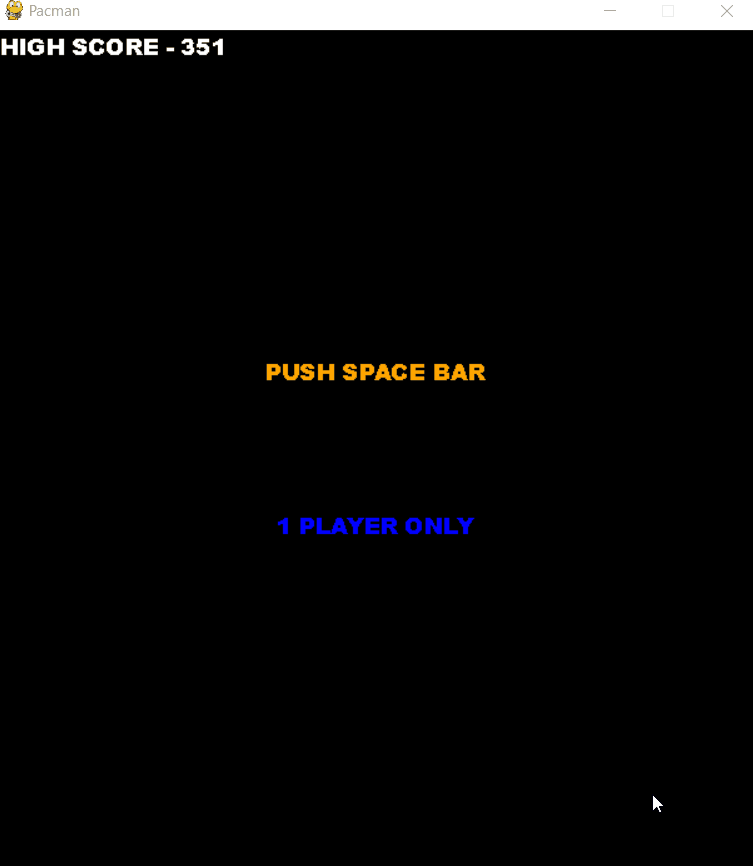

# Pacman-Pygame
Made with ❤️ using Pygame 2.x and converted to exe using Pyinstaller. Download .exe file from [here](https://github.com/kushagra219/Pacman-Pygame/blob/main/pacman.exe?raw=true).

## Features 
* Implemented normal grid movement for player & enemies
* Implemented BFS to make smart enemies (red & blue ghosts follow the player by finding the shortest path between their and the player's position)
* Added player intermission timer for pacman to eat enemies
* Added original pacman images, bg music & sound effects etc.

## Sample Gameplay

## Note
* This work is not entirely original, it has been largely influenced & an extended version of https://github.com/a-plus-coding/pacman-with-python. 
